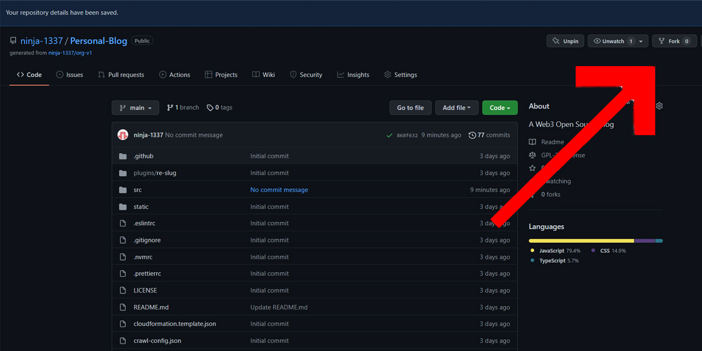
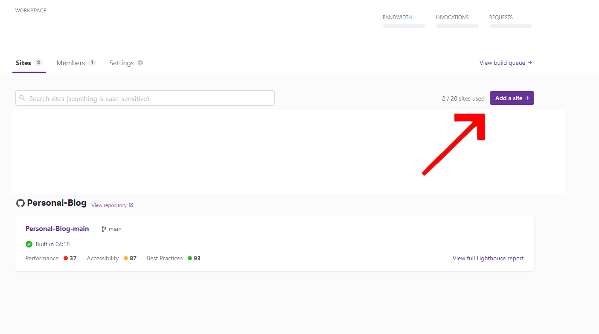
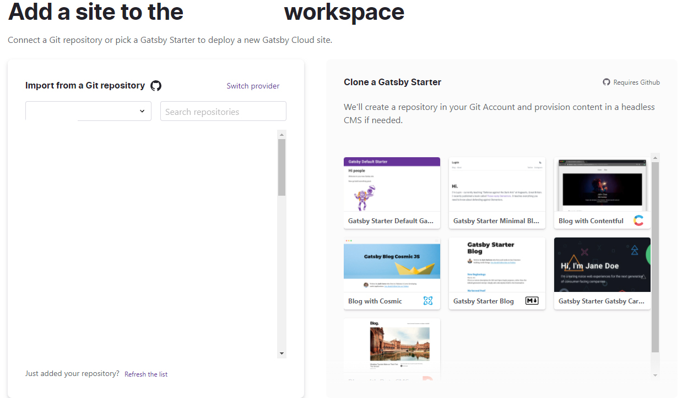
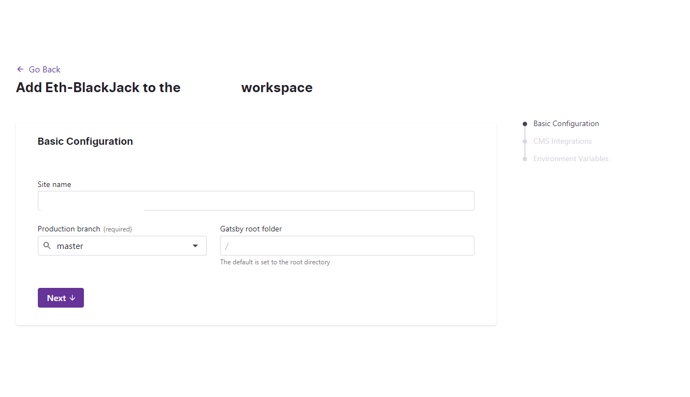

# Fork GitHub repo

If you dont already hace a github account you will need to create one here https://github.com/join.  
Then you will need to navigate to https://github.com/ninja-1337/Personal-Blog and press the fork button on the upper right corner. 

 
Congratz You forked your own personal blog

 
Well almost you still need to deploy to a hosting provider.
Atleast You got the files ready.
 

---
# Deploy To Gatsby Cloud
For this you will have to have a Gatby Cloud account. 
After You Login to your account create a new Site 

 

Import the github repo you just forked. 

Click Next on all and then Build Site. 

 

# Editing Blog Info 

After you fork the blog you will probably want to edit some info and Write your own Blogs. 
You can do that By navigating to the Personal Blog project in your github account and then pressing . on your keyboard. 
This will open a web editor for your project.

# Write your own Blogs

# Edit a Blog entry

# Commit and push changes to the Blog entry

# Use your own domain name.

<small>Thanks to Uniswap.</small>
