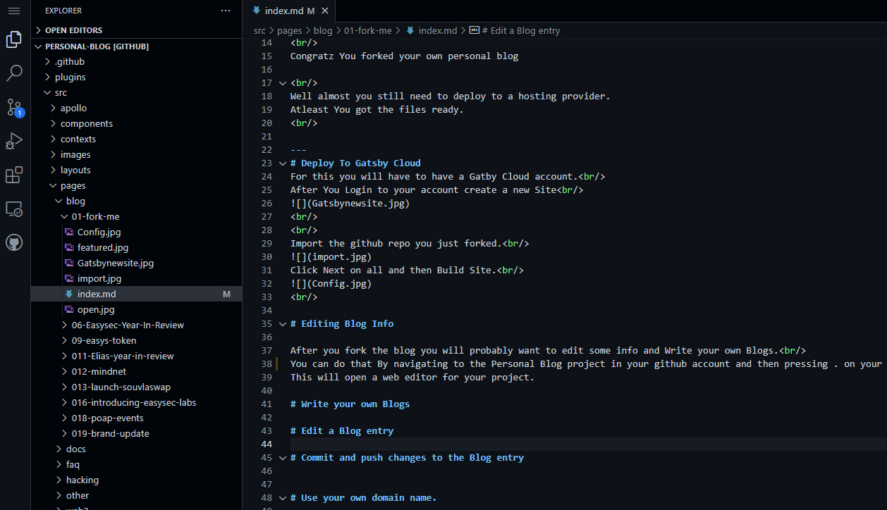
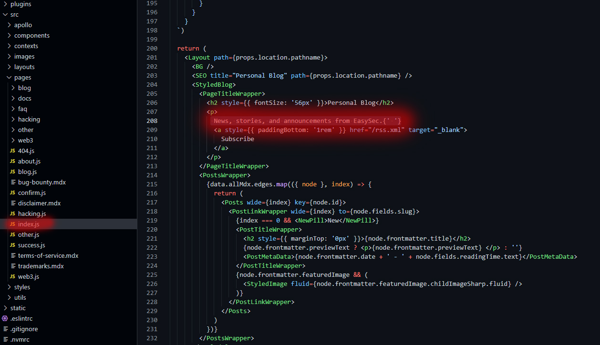
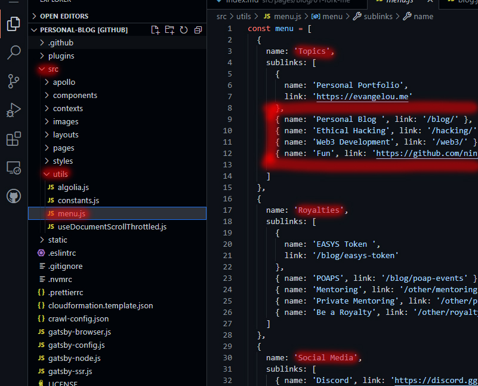
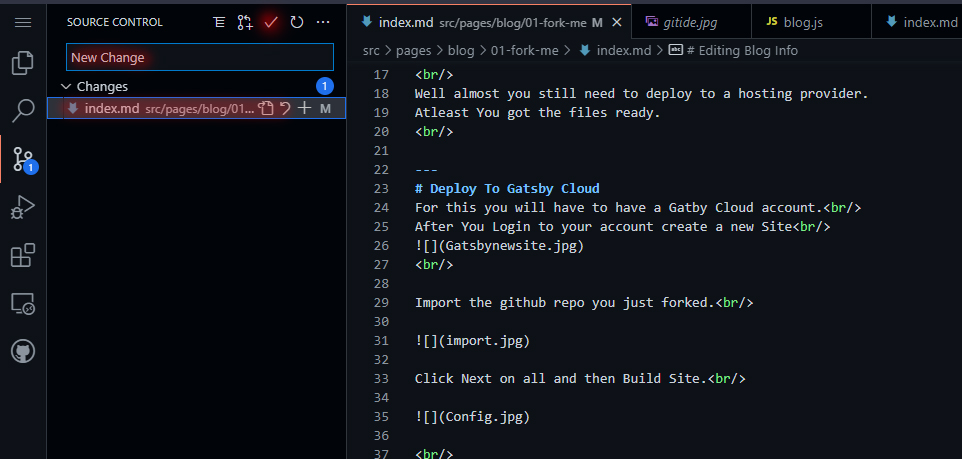

# Fork GitHub repo

If you dont already hace a github account you will need to create one here https://github.com/join.  
Navigate to https://github.com/ninja-1337/Personal-Blog and press the fork button on the upper right corner. 

 
Congratz You forked your own personal blog

 
Well almost you still need to deploy to a hosting provider.
Atleast You got the files ready.
 

---
# Deploy To Gatsby Cloud
For this you will have to have a Gatby Cloud account. 
After You Login to your account create a new Site 

 

Import the github repository you just forked. 

Click Next on all and then Build Site. 

 

# Editing Blog Info 

After you fork the blog you will probably want to edit some information and author your own Blogs. 
Navigate to the Personal Blog project in your github account and then press . on your keyboard. 
This will open a web editor for your project directly in your browser. 

 
You can edit the main page by editing index.js in /src folder
 

# Write your own Blogs
Each Folder in the /src/blog is a blog entry. 
The index.md file is waht cosnists of the blog. 
The format used is markdown. 
Markdown is a text-to-HTML conversion tool for web writers. Markdown allows you to write using an easy-to-read, easy-to-write plain text format 
# Edit a Menu entries

You can edit the main page by editing menu.js in /src/utils folder
  

 

# Commit and push changes to the Blog entry by adding a commit message and pressing the tick button

 

# Use your own domain name.

<small>Thanks to Uniswap.</small>
