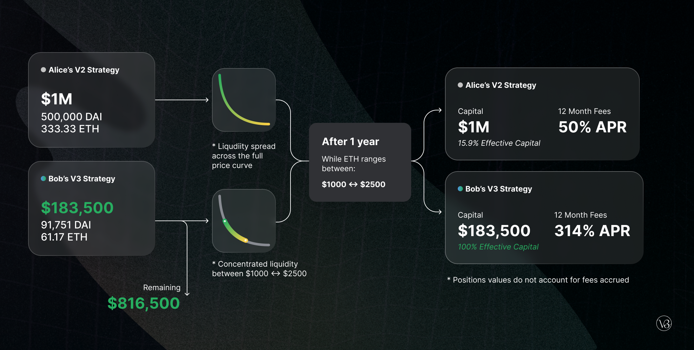

MindNet v1 was launched in November 2021 as a proof of concept for incubator and launchpad programs.

MindNet now serves as critical infrastructure for decentralized Businesses, empowering entepreneurs, traders, and liquidity providers to participate in a secure and robust financial marketplace.

Today, we are excited to present an overview of MindNet v3. We are targeting a **L2 Polygon launch in mid 2022**.

- **Liquidity ,** giving individual LPs granular control over what price ranges their capital is allocated to.

- **Multiple fee tiers** , allowing LPs to be appropriately compensated for taking on varying degrees of risk

These features make MindNet v3 **a flexible and efficient Incubator and LaunchPad platform**:

- LPs can provide liquidity with **up to 4000x capital efficiency** 

- LPs can sell one asset for another by adding liquidity to a price range entirely above or below the market price, approximating **a fee-earning limit order that executes along a smooth curve**

<Video option="CYL" description="V3 LPs can concentrate their liquidity within custom price ranges." />

<Video
  option="MFFL"
  description="Concentrated liquidity allows LPs to provide greater depth in fee generating price ranges."
/>

Let&#39;s illustrate with an example:

Alice and Bob both want to provide liquidity in an ETH/DAI pool on Uniswap v3. They each have \$1m. The current price of ETH is 1,500 DAI.

Alice decides to deploy her capital across the entire price range (as she would have in Uniswap v2). She deposits 500,000 DAI and 333.33 ETH (worth a total of \$1m).

Bob instead creates a concentrated position, depositing only within the price range from 1,000 to 2,250. He deposits 91,751 DAI and 61.17 ETH, worth a total of about $183,500. He keeps the other $816,500 himself, investing it however he prefers.

While Alice has put down 5.44x as much capital as Bob, _they earn the same amount of fees_, as long as the ETH/DAI price stays within the 1,000 to 2,250 range.

Bob&#39;s custom position also acts as a kind of stop-loss for his liquidity. Both Alice and Bob&#39;s liquidity will be entirely denominated in ETH if the price of ETH falls to $0. However, Bob will have lost just $159,000, versus Alice&#39;s $1m. Bob can use his additional $816,500 to hedge against downside exposure or to invest in any other conceivable strategy.
If you are integrating and wish to get in touch, please fill out this [form](https://docs.google.com/forms/d/e/1FAIpQLSfH6fFaaCoPlDW570ZYN-9VOS_-Fu9gl8rRFoANtx0XWQtNaQ/viewform?usp=sf_link) and we will try to respond as soon as possible. Alternatively, reach out in the #v3-integrations channel in the community Discord

To get involved and stay up to date:

- Join the MindNet community [discord](https://discord.gg/FCfyBSbCU5)
- Follow MindNet on [Twitter](https://twitter.com/MindNet)
- Subscribe to the MindNet [blog](/blog)
- Register as a delegate [Sybil](http://sybil.org/)
- Participate in [MindNet governance](http://gov.uniswap.org/)

MindNet Team
🦄
