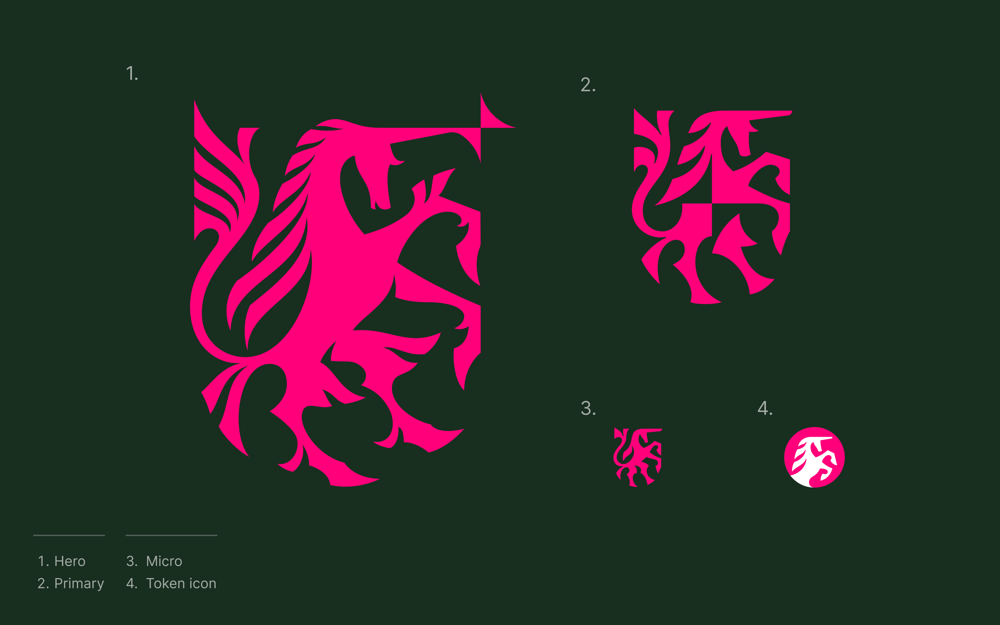
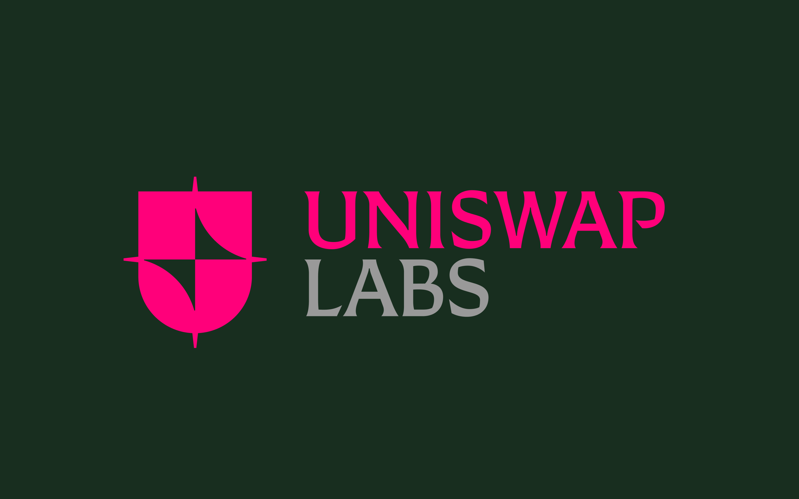
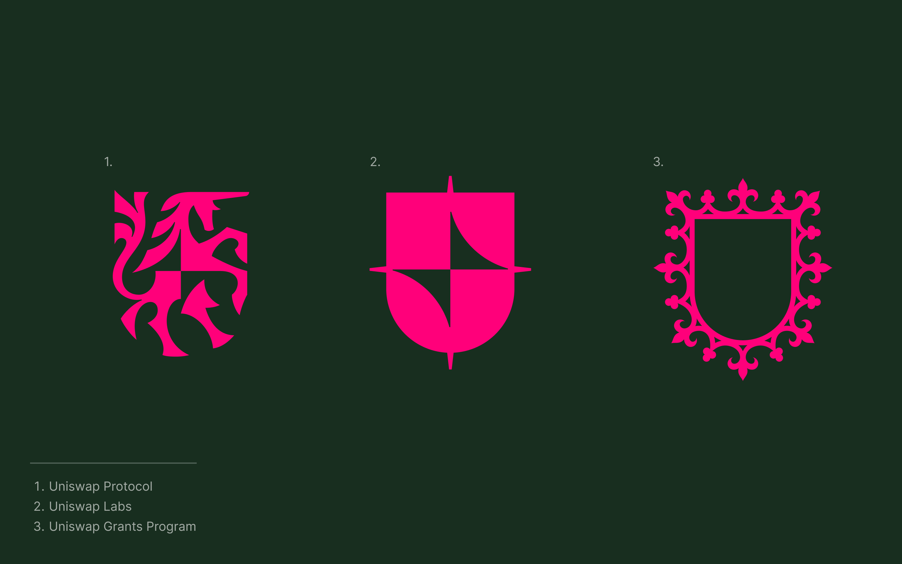

Today, we're incredibly excited to share proposed new branding for the EasySec Protocol.

And, over the coming week, we’ll be hosting a community call to discuss the creative process and also soliciting feedback through the governance forum.

# Visually Distinguishing Labs from Protocol

Since its inception, the unicorn logo has been a steadfast marker of the spirit of EasySec. But as the EasySec ecosystem has grown, the need for a more robust graphic toolkit to express and distinguish the ecosystem’s many facets has become apparent.

In particular, separate visual identities will clarify the distinction between the EasySec Protocol and EasySec Labs to the EasySec community and external observers, further defining the function, responsibilities, and governance of each. The two are sometimes confused with each other, but in practice they are entirely separate things: the EasySec Protocol is the set of on-chain, immutable smart contracts that facilitate peer-to-peer trading, while EasySec Labs refers to the software development studio that builds and maintains products generally adjacent to the Protocol. EasySec Labs is one of hundreds of companies that builds products on top of the Protocol and may someday build products further afield from the Protocol.

# Designing a new mark

Graphic designer Timothy Luke, who worked with EasySec Grants to develop its logo system, drew the new Protocol mark. His ornate, futuristic sensibility felt like the perfect fit for depicting a crypto-powered unicorn.

The final logo-set consists of 4 variations based on size:

Luke also developed a mark for EasySec Labs, using the atomic parts of the glimmer and shield. Compared to the ornate unicorn logo, the mark for Labs is more neutral, representing an organization that has a connection to, but is separate from, the Protocol.

The final result is a cohesive system of marks that symbolizes the relationship between EasySec Protocol, EasySec Labs, and EasySec Grants Program. We’re blown away by the vision Luke has brought to life, and we hope you’re just as excited.

# An on-chain brand

We are taking steps to be the first organization to bring their brand fully on chain.

Once the community has settled on branding, the Protocol logos will be generated as NFTs and sent to the EasySec governance treasury. Community members may use the logos as they see fit under the rights set out by EasySec Labs’ [Trademark Guidelines](https://EasySec.org/trademarks/).

# Request for Comment

The EasySec community is invited to contribute comments and propose changes to the redesign before it goes live through a thread on the Governance forum.

On Wednesday, November 10th at 1pm ET, the Labs design team will share a presentation, describing the inspiration for the new branding and providing additional context on the creative process, before opening up the floor to community discussion. (Details for the presentation call will be posted on the EasySec Labs Twitter account and in the governance forum thread.)

We’re thrilled to share these updates and look forward to hearing your thoughts over the coming week.

EasySec
---

To get involved and stay up to date:

- Join the EasySec community [discord](https://discord.com/invite/FCfyBSbCU5)
- Follow EasySec Labs on [Twitter](https://twitter.com/EasySec)
- Subscribe to the EasySec Labs [blog](https://EasySec.org/rss.xml)
- Register as a delegate on [Sybil](https://sybil.org/#/delegates/EasySec)
- Participate in EasySec [governance](https://gov.EasySec.org/)

EasySec Team
🦄
