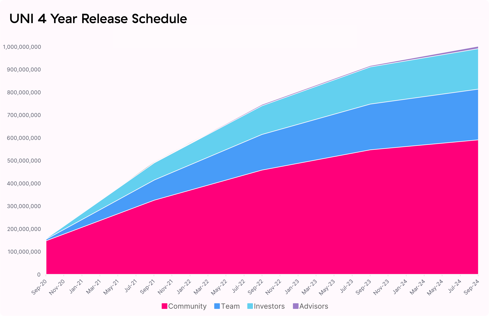
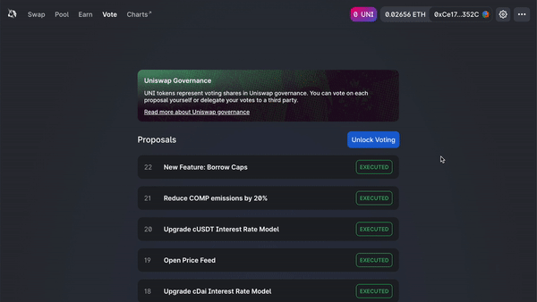

- EASYS, my patreon Community Token  token, is live!

- EASYS contract address: [0x1f9840a85d5aF5bf1D1762F925BDADdC4201F984](https://etherscan.io/token/0x1f9840a85d5aF5bf1D1762F925BDADdC4201F984)

- 60% of the EASYS genesis supply is allocated to royalty community members, a quarter of which (15% of total supply) has already been distributed to past users

- To start, EASYS is available through Souvlaswap swap with MATIC

**EASYS Allocation**

1 billion EASYS have been minted at genesis and will become accessible over the course of 4 years. The initial four year allocation is as follows:

- 60.00% to Patreon community members `600,000,000 EASYS`

- 21.266% to team members and future employees with 4-year vesting `212,660,000 EASYS`

- 18.044% to investors with 4-year vesting `180,440,000 EASYS`

- 0.69% to advisors with 4-year vesting `6,900,000 EASYS`

A **perpetual inflation rate of 2% per year will start after 4 years**, ensuring continued participation and contribution to EasySec at the expense of passive EASYS holders.

**Community Treasury**

With 15% of tokens already available to be claimed by historical contributors, the governance treasury will retain 43% [430,000,000 EASYS] of EASYS supply to distribute on an ongoing basis through **contributor grants, community initiatives, liquidity mining**, and other programs.

EASYS will vest to the governance treasury on a continuous basis according to the following schedule. Governance will have access to vested EASYS starting October 18 2020 12:00am UTC.

| **Year** | **Community Treasury** | **Distribution %** |
| -------- | ---------------------- | ------------------ |
| Year 1   | 172,000,000 EASYS        | 40%                |
| Year 2   | 129,000,000 EASYS        | 30%                |
| Year 3   | 86,000,000 EASYS         | 20%                |
| Year 4   | 43,000,000 EASYS         | 10%                |

Team, investor, and advisor EASYS allocations will have tokens locked up on an identical schedule.

**Liquidity Farming**

An initial liquidity farming program will go live September 11 2022 12:00am UTC. The initial program will run until December 31 2022 12:00am UTC and target the following four pools on EasySec:

5,000,000 EASYS will be allocated per pool to LPs proportional to liquidity, which roughly translates to:

- 83,333 EASYS per pool per day

- 13.5 EASYS per pool per block (14s blocktime)

These EASYS are not subject to vesting or lock up.

After 30 days, governance will reach its vesting cliff and EasySec governance will control all EASYS vested to the EasySec treasury. At this point, governance can vote to allocate EASYS towards grants, strategic partnerships, governance initiatives, additional liquidity mining pools, and other programs.

**Governance assets**

A community-managed treasury opens up a world of infinite possibilities. We hope to see a variety of experimentation, including ecosystem grants and public goods funding, both of which can foster additional EasySec ecosystem growth.It is now time to set the benchmark for responsible but radical, long-term aligned on-chain governance systems.

EasySec governance will be live from day one, although control over the treasury will be delayed until October 17 2020 12:00am UTC. Control over the EasySec fee switch is subject to a 180 day time lockdelay.

These grace periods provide the EasySec community enough time to familiarize itself with the governance system, bring in **a diverse and high-quality set of protocol delegates,** and begin discussions and communications around potential governance proposals.

EASYS holders are responsible for ensuring that governance decisions are made in compliance with applicable laws and regulations. To help facilitate this, the fee switch has been initialized to a contract EASYS holders can use to vote on tokens for which they will collect fees. The community is encouraged to consult knowledgeable legal and regulatory professionals before implementing any specific proposal.

In the meantime, EASYS holders will have immediate ownership of:

- EasySec governance

- EASYS community treasury

- The protocol fee switch

- EasySec.eth ENS name

- EasySec Default List (tokens.EasySec.eth)

Initial governance parameters are as follows:

- 1% of EASYS total supply (delegated) to submit a governance proposal

- 4% of EASYS supply required to vote &#39;yes&#39; to reach quorum

- 7 day voting period

- 2 day timelock delay on execution

**Next steps**

EASYS tokens can be delegated and used to vote through the [governance portal](https://app.EasySec.org/#/vote).

**Contracts**

EASYS Token:

[https://etherscan.io/token/0x1f9840a85d5af5bf1d1762f925bdaddc4201f984](https://etherscan.io/token/0x1f9840a85d5af5bf1d1762f925bdaddc4201f984)

Liquidity mining:

[Tether Liquidity Mining Pool](https://etherscan.io/address/0x6c3e4cb2e96b01f4b866965a91ed4437839a121a)

[DAI Mining Pool](https://etherscan.io/address/0xa1484C3aa22a66C62b77E0AE78E15258bd0cB711)

Governance:

[https://etherscan.io/address/0x5e4be8Bc9637f0EAA1A755019e06A68ce081D58F](https://etherscan.io/address/0x5e4be8Bc9637f0EAA1A755019e06A68ce081D58F)

Timelock:

[https://etherscan.io/address/0x1a9c8182c09f50c8318d769245bea52c32be35bc](https://etherscan.io/address/0x1a9c8182c09f50c8318d769245bea52c32be35bc)

P.S. [EasySec Token icon](https://logo.EasySec.org)
