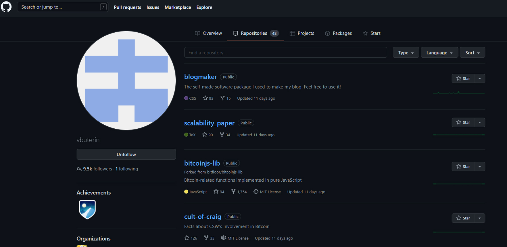
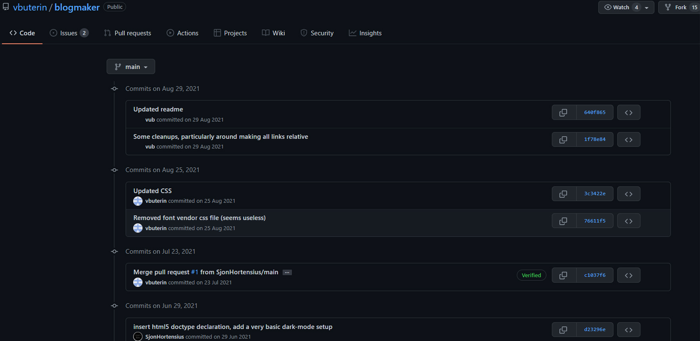
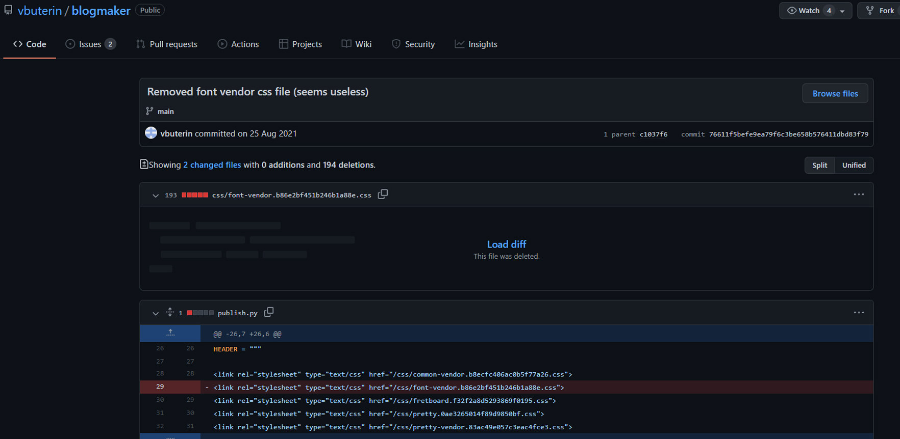
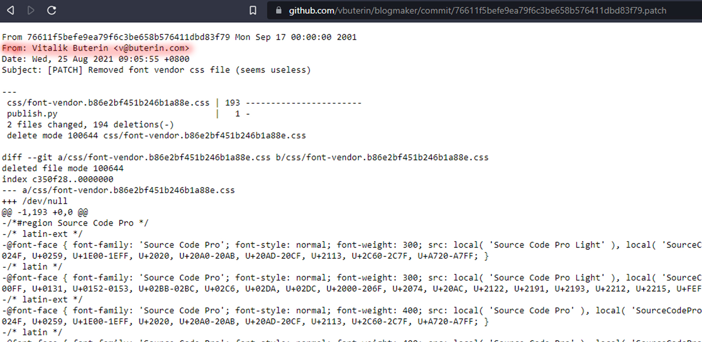

If a user has made a commit to a public repository on GitHub, there is a high probability that their email address is publicly accessible.
 

# How it works 
 

GitHub uses the email address associated with a GitHub account to link commits and other activity to a GitHub profile. 
When a user makes commits to public repos their email address is usually published in the commit and becomes publicly accessible.
 

GitHub provides some instructions on how to prevent this from happening, but it seems that most GitHub users either don't know this or don't care that their email address may be exposed.
 

# Locate a GitHub user profile 
 

We will discover the email address of Vitalik Buterin a well known person in the cryptocurency space.

 

#  Locate a non-forked repository 
We will just chose the first one.

 

# Locate a commit by the user
 
Within the repository view you can see a "commits" link on the right hand side of the page.
 
The more commits there are, the more likely it is to find a commit by the user. In this case we see 24 commits.
 

 

All we need is to find a single commit by the target user to find their email address.
Click on the commits link to be taken to a commit history view.
 

When viewing the commit history your target is to find one or more commits created by the target GitHub user.

 

Once you locate a promising commit click on the commit ID on the right hand side to view the actual commit.
The page will look something like the picture below.

 

# Convert to the patch view to locate the email address

What you want to do next is look at the URL in your browser navigation bar. Add ".patch" to the end of the URL and press ENTER
 

Once the patch view loads you need to examine the commit info to the find the target author.
All authors have a name and email address.

You have located the user's email address!
 

# Note that this email might not be the real one.
GitHub has a privacy option to enable masking user emails.
Some users enable that privacy option. In that case, you will notice an email that looks something like this: username@users.noreply.github.com 
 

# In that case you should try enumerating more commits.
Older commits especially the first ones a GitHub user commited have a greater chance to yield information.

 
With this method  you can find 90% of email addresses on GitHub as long as the person has a commit history. GitHub is what most software developers use.
Add this method to your tool belt, it will come in handy more often than you think!

Finding a GitHub user's email address is often as simple as looking at their recent events via the GitHub API.
 

Lastly, feel free to reach out if you think there is a better way to do things 
 

---

To get involved and stay up to date:

- Join the EasySec community [discord](https://discord.com/invite/FCfyBSbCU5)
- Follow EasySec Labs on [Twitter](https://twitter.com/EasySec)

EasySec Team 🦄
